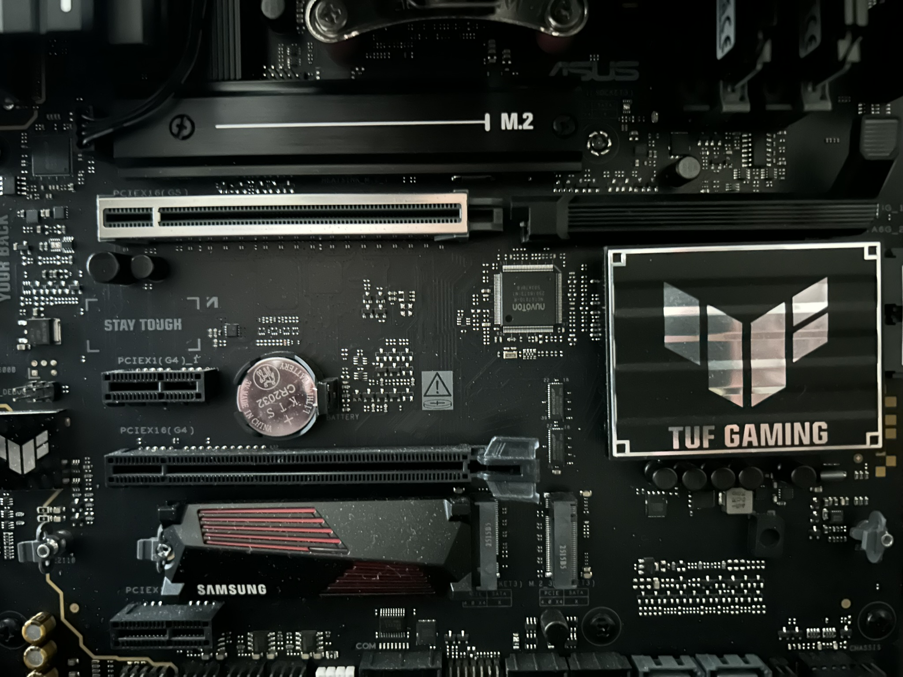
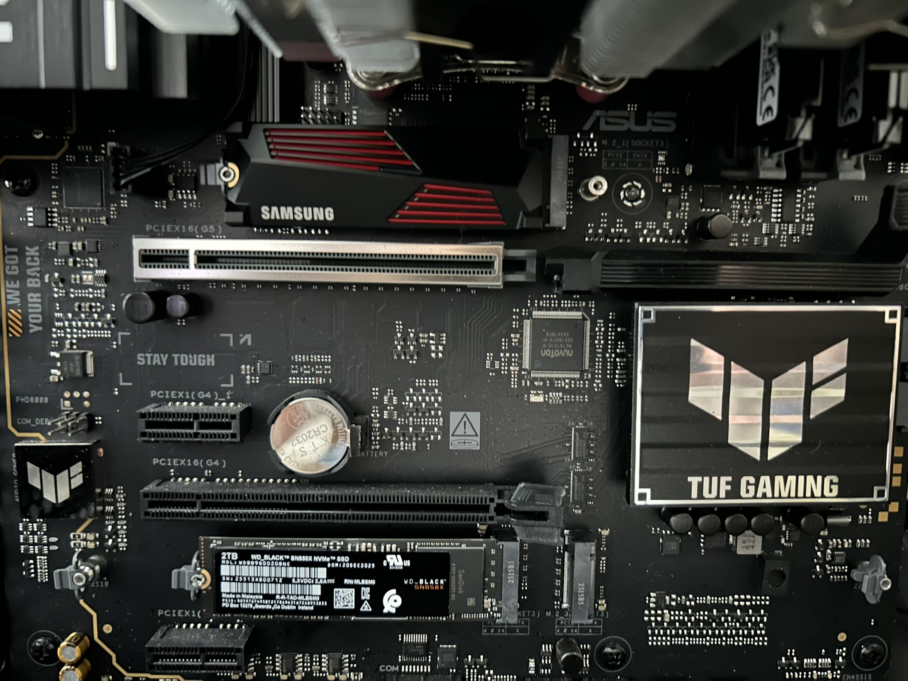
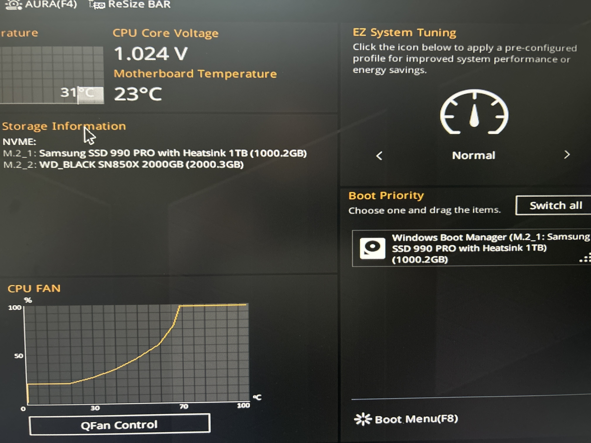
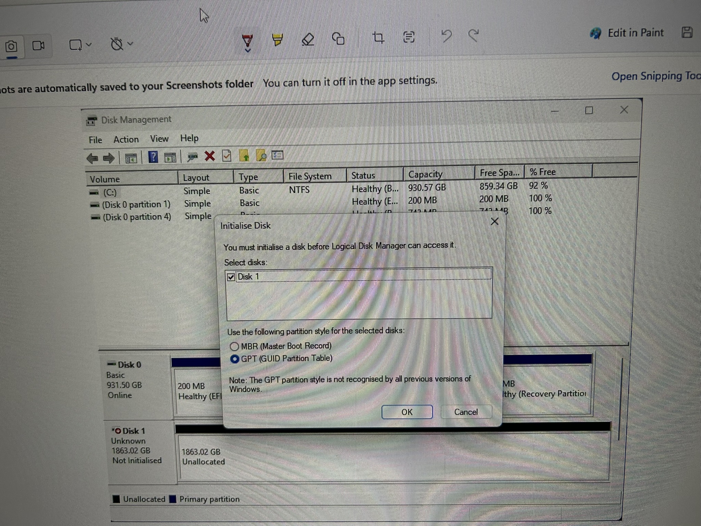

# NVMe Storage Expansion and Boot Drive Migration

## Objective

Upgrade the workstation storage configuration by moving the primary NVMe drive to the CPU-connected M.2 slot and installing a secondary NVMe drive dedicated to lab workloads.

---

## Hardware

Motherboard: ASUS TUF Gaming  
Primary NVMe: Samsung 990 Pro 1TB (with heatsink)  
Secondary NVMe: WD Black SN850X 2TB  
Operating System: Windows 11

---

## Initial Hardware State

Primary M.2 slot identified before installing the NVMe drives.

---

## NVMe Installation

Samsung 990 Pro installed in the primary M.2 slot.

WD Black SN850X installed in the secondary M.2 slot.

---

## BIOS Verification

The BIOS successfully detected both NVMe drives.

- M.2_1: Samsung 990 Pro 1TB
- M.2_2: WD Black SN850X 2TB
- Boot Device: Windows Boot Manager

---

## Disk Initialization

The new NVMe drive was initialized using GPT partition style.

---

## Disk Configuration

The WD Black SN850X was formatted as an NTFS volume using Windows Disk Management.

---

## Final Storage Layout

Final workstation storage configuration:

C: Samsung 990 Pro 1TB  
Operating System and Applications

D: LABS (WD Black SN850X 2TB)  
Virtual Machines  
Security Tools  
Lab Environments

---

## Lessons Learned

- Primary NVMe slots connected directly to the CPU should be used for the OS drive.
- GPT partitioning is required for modern UEFI systems.
- Separating operating system and lab storage improves performance and organization.
- Hardware upgrades should be validated at the BIOS and OS level.
